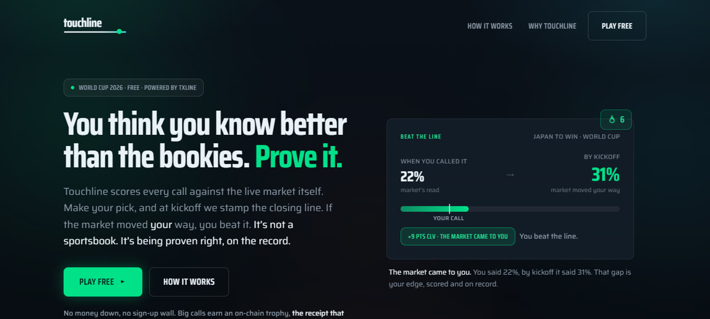
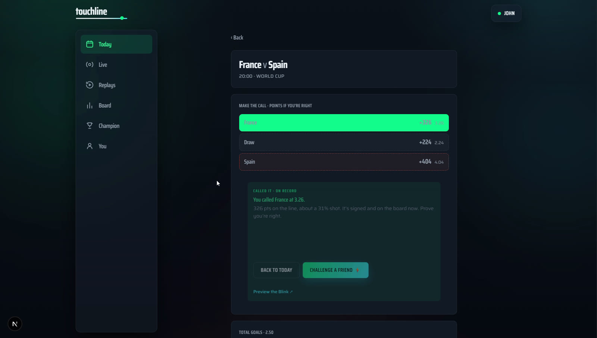
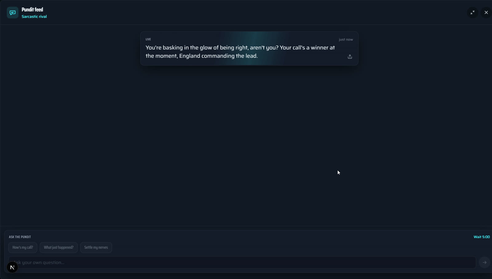
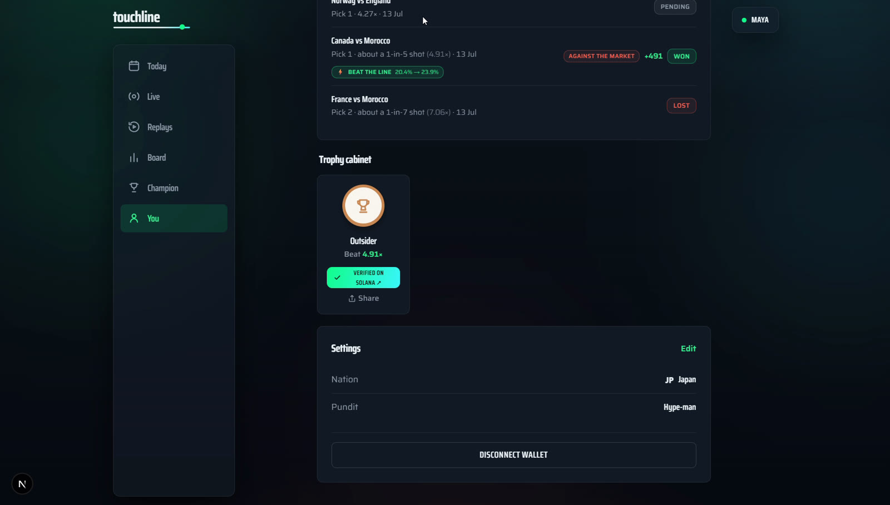

# Touchline

**Call it before your mates do.** A free-to-play World Cup prediction game where every call is scored against the live market, narrated by an AI pundit, and proven forever with an on-chain trophy on Solana. Powered end to end by **TxLINE** live data.

Built for the **TxODDS World Cup Hackathon** (Consumer and Fan Experiences track).

| | |
|---|---|
| **Live app** | https://touchline-game.vercel.app |
| **Demo video** | [`demo/touchline-demo.mp4`](demo/touchline-demo.mp4) |
| **Chain** | Solana devnet (Metaplex Core trophies, free to claim) |
| **Data** | TxLINE devnet, World Cup `competitionId 72` |



## The problem

Every match, millions of fans call the result before kickoff, in group chats, with zero proof and nothing to show for being right. Bookmaker odds are the sharpest public measure of how hard a call was, but fans who do not want to risk money have no way to play against them.

Touchline fixes that: make your call, it locks at kickoff against the real line, an AI pundit tracks it live, and beating the closing line earns a trophy that proves it forever. It is explicitly **not** a sportsbook. Stakes are streaks, rank and trophies, never money.

## What it does

- **The core loop.** Every World Cup fixture with live TxLINE decimal odds. Pick a result, lock it in, and the pick is stamped server-side at kickoff. Scoring is odds-weighted: the harder the call, the more points it pays.
- **Beat the Line.** The differentiator. Your odds at lock are compared with the closing line. If the market moved toward your call by kickoff, you beat the close, the sharpest signal in the game, worth a +25% bonus and tracked as a per-user Sharp Rating. This is CLV (closing line value), reframed in fan language.
- **A live AI pundit.** Each match gets a pundit persona that knows your call, the live score and the line. It reacts to goals, cards and odds swings, posts 5-minute match reports, and answers questions mid-match in character (rate-limited server-side).
- **Match replays.** Any finished match can be replayed through the exact same live pipeline from real recorded TxLINE events, on public pages with no sign-in. Judges can experience the live product even after the tournament ends: append `?speed=600` to watch a full match arc in about 12 seconds.
- **On-chain trophies.** Standout calls (long shots, line-beaters) mint as real Metaplex Core NFTs on Solana devnet, free, one click, verifiable on the explorer.
- **Star Man, leagues, bracket.** Name a scorer once lineups drop, private leagues with invite codes, and a knockout bracket with stage multipliers.





## How TxLINE powers the backend

```
TxLINE (SSE + REST + on-chain access)
        |
        v
apps/worker  (persistent Node service)
  normalize wire events -> Postgres
  snapshot odds at kickoff (the lock)
  closing-line sweep -> Beat the Line
  score + settle picks (idempotent)
  drive the AI pundit
  record events -> replay engine
  mint Metaplex Core trophies
        |
        v
WebSocket fan-out -> apps/web (Next.js PWA)
```

A Next.js frontend cannot hold SSE connections open, so all TxLINE access lives in a persistent worker. Tokens never reach the browser.

### TxLINE endpoints used

| Endpoint | Use |
|---|---|
| `POST /auth/guest/start` | Guest JWT to bootstrap access |
| on-chain `subscribe(serviceLevelId, weeks)` | Solana devnet instruction that activates the data subscription |
| `POST /api/token/activate` | Exchange the subscribe tx signature for the `X-Api-Token` |
| `GET /api/fixtures/snapshot` | Fixture list for the World Cup (`competitionId 72`) |
| `GET /api/odds/snapshot/{fixtureId}` | Odds at a moment in time; `?asOf=<ms>` stamps the line at lock and at close |
| `GET /api/odds/stream` (SSE) | Live odds, fanned out to every browser and used as scoring weights |
| `GET /api/scores/snapshot/{fixtureId}` | Score state backfill |
| `GET /api/scores/stream` (SSE) | Live goals, cards, status and lineups driving scoring, the pundit and replays |

Two details we lean on hard: TxLINE's **de-margined implied probabilities (`Pct`) are the scoring weights themselves**, not just display data, and `?asOf` snapshots make the Beat the Line comparison (line at lock vs closing line) reproducible and auditable.

## Technical highlights

- **Wire-truth schema layer.** The live wire format differs from the published OpenAPI spec in places (casing, field slots, status codes). `packages/shared` validates both shapes with zod and normalizes to one internal model, with drop-counters so no event is ever lost silently. Details in the feedback section below.
- **Server-side integrity.** Picks lock at kickoff using server time, scoring and settlement are idempotent (a settled pick can never be re-scored), and the closing-line sweep writes `pctAtClose` exactly once per pick with guarded updates.
- **Replay isolation.** The replay engine replays recorded events over a per-socket channel and is import-isolated from the live scoring path, verified by a functional test asserting zero real writes.
- **All TypeScript monorepo.** `apps/web` (Next.js App Router PWA), `apps/worker` (live engine), `packages/shared` (zod schemas + scoring rules shared by both).

## Business path

Free to play for the World Cup. The engine is competition-agnostic, any TxLINE-covered competition can run next season (Premier League first). Revenue paths: sponsored private leagues and club partnerships, premium pundit personas and voice narration, and collectible on-chain trophy drops for standout calls.

## Running locally

See [RUN.md](RUN.md) for the full guide. Short version:

```bash
pnpm install
cp apps/worker/.env.example apps/worker/.env   # add your keys
pnpm dev:worker   # live engine on :8787
pnpm dev:web      # app on :3000
```

The worker performs the TxLINE guest -> subscribe -> activate flow on boot with a devnet wallet and holds the SSE streams open. Without TxLINE credentials it still boots and serves recorded replays.

## TxLINE API feedback

**What we liked most**
- The de-margined `Pct` field is a gift: an honest probability per outcome that we could use directly as the scoring weight, no margin math on our side.
- `?asOf` odds snapshots made the whole Beat the Line feature possible with two cheap requests per pick.
- The SSE streams were reliable for days at a time, and the on-chain subscription flow (guest JWT, `subscribe`, activate) is genuinely novel: paying for data access with a devnet transaction and getting anchored data back.

**Where we hit friction** (all worked around, documented here so the team can fix them)
- The live scores wire sends PascalCase fields (`Score`, `Data`, `StatusId`) while the OpenAPI spec documents camelCase; our schema validates both.
- Terminal `StatusId 100` means "finished" generically, so the finish variant (FT, AET, on penalties) has to be re-derived from the score periods.
- Goal events carry `{GoalType, PlayerId}` but no participant side; we attribute the scoring side by joining `PlayerId` against lineup team ids.
- Lineup player ids arrive as UUID strings while the spec types them as numbers.
- The documented dev host `oracle-dev.txodds.com` did not resolve for us; `txline-dev.txodds.com` is the working host.
- `subscribe` requires `weeks` to be a multiple of 4, which is only discoverable from the on-chain error.

## Compliance note

Touchline contains no wagering. Nothing of monetary value is risked or paid out; odds are used as a difficulty signal for a free points game, and trophies are free commemorative NFTs.

## License

MIT
